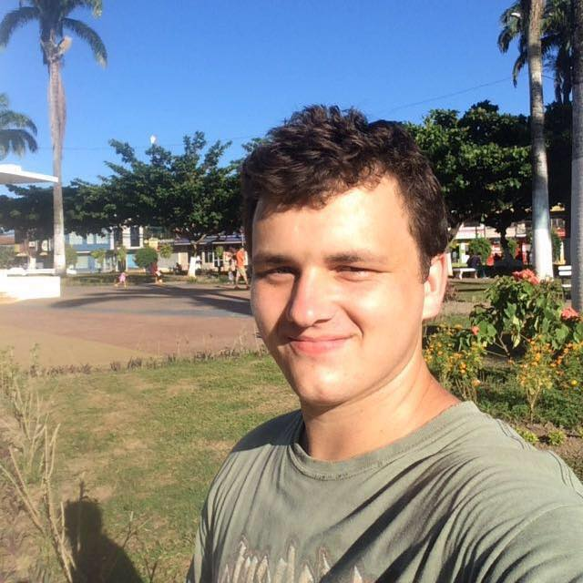

# Alsey Coleman Miller

Seasoned iOS Developer experienced in designing and developing custom applications ranging from home automation, to social and business apps. Works well independently as a Freelancer and in teams of all sizes. Anticipates customer needs and meets project requirements. Skilled in cross-cultural communication. Natural learner. In the top 1% most active open source Swift contributors on GitHub (4000+ commits and 1500+ stars in 2016). Contributed to Swift compiler, reverse engineered Apple’s Foundation framework and wrote clone of UIKit for Linux. Also loves Hackintoshes.

----

## Skills

- Languages: C (5 years), Objective-C (4 years), Swift (2 years)

- Platforms: macOS, iOS, watchOS, tvOS, Linux

----

## Contact

* Email: [alseycmiller@gmail.com](mailto:alseycmiller@gmail.com)

* Skype: `coleman_cda`

* GitHub: [colemancda](https://github.com/colemancda)

* Twitter: [@colemancda](https://twitter.com/colemancda)

* LinkedIn: [Alsey Coleman Miller](https://www.linkedin.com/in/colemancda/)

----

## Experience

### MAG Technologies LLC
#### Senior iOS Developer; Dallas, TX; July 2016 - Present
Responsible for maintaining Objective-C / Swift codebase and working on new features for end-to-end encrypted iOS messaging app.

- [Website](http://www.sayfeapp.com)
- [iTunes Store](https://itunes.apple.com/us/app/sayfe-secure-private-messenger/id1050787926)

### Parkarr
#### Senior iOS Developer; NYC, NY; February 2016 - July 2016
Implemented improvements in Swift for application used to locate parking spots (as featured on ABC’s Shark Tank).

- [Website](http://www.parkarr.com)
- [iTunes Store](https://itunes.apple.com/us/app/parkarr/id1061745625)

### Santex Group
#### Lead Mobile Developer; Lima, Peru; July 2015 - Present
Responsible for estimation, architecture, and development of various iOS apps for clients. Developed open source Swift libraries that were reused across various projects. Swift and open source evangelist.

- [Website](http://www.santexgroup.com)
- [GitHub](https://github.com/Santex-Mobile)
- [OpenStack Foundation Summit](https://github.com/OpenStack-mobile/summit-app-ios)
- [MyVistage](https://itunes.apple.com/us/app/my-vistage/id891220703)

### Sysco SA
#### Senior iOS Developer; Lima, Peru; March 2015 - July 2015
Responsible for maintaining Objective-C codebase of a suite of apps for the management of kindergartens in Norway.

- [Website](https://vigilo.no)
- [iTunes Store](https://itunes.apple.com/us/app/vigilo-foresatt-barnehage/id771731428)

### Unikey Technologies
#### Senior iOS Developer; Winter Park, FL; September 2014 - March 2015
Developed iOS application for unlocking your door via Bluetooth LE (as featured on ABC’s Shark Tank). Updated codebase for iOS 8, migrated Objective-C code to Swift, implemented Adaptive UI, and refactored code for internal framework targets. 

- [Website](http://www.unikey.com)
- [iTunes Store](https://itunes.apple.com/us/app/kevo-your-phone-is-now-your-key/id685604951)

### Voalte
#### iOS Developer; Sarasota, FL; January 2014  - September 2014
Responsible for debugging and increasing the performance of Voalte's iOS apps collaboratively with engineering team. Implemented concurrency, MVC design, and updated code for iOS 8. Also worked heavily with XMPP and REST APIs.

- [Website](http://www.voalte.com)
- [iTunes Store](https://itunes.apple.com/us/app/voalte-one/id350193462)

### Tecla Labs
#### iOS Developer; Lima, Peru; January 2013 - May 2013
Worked as an iOS developer, creating new projects and supporting existing projects as needed. Developed a catalog app for a Peruvian jewelry company and worked on an iOS framework for rapid deployment of iOS apps for small businesses. Also worked on a Cocos2D runner game, social puzzle app, and Instagram-like app with image filters.

- [Website](http://www.teclalabs.com)
- [iTunes Store](https://itunes.apple.com/gb/app/aldo-co.-encuentra-tu-anillo/id648603114)

----

## Projects

- [SwiftFoundation](https://github.com/PureSwift/SwiftFoundation ) - Cross-Platform, Protocol-Oriented Programming base library to complement the Swift Standard Library.

- [BluetoothLinux](https://github.com/PureSwift/BluetoothLinux) - Pure Swift Bluetooth Stack for Linux (does not require user land C libraries, communicates directly with the Linux kernel).

- [Cacao](https://github.com/PureSwift/Cacao) - Pure Swift Cross-platform UIKit (Cocoa Touch) implementation (Supports Linux).

- [NetworkObjects](https://github.com/colemancda/NetworkObjects) - Creates a REST API from a Core Data model. First Open Source Objective-C server framework (1000 commits, deprecated)

- [Wi-Fi Crack](https://github.com/colemancda/Wi-Fi-Crack) - Wi-Fi Crack allows you to crack any wireless network with WEP security. Powered by [Aircrack-ng](http://www.aircrack-ng.org). Wi-Fi Crack was the most popular app for month of April 2014 on [MacUpdate.com](https://www.macupdate.com/app/mac/46004/wi-fi+crack), with over 250k downloads. 

----

## Languages

- English (Native)

- Spanish (Fluent)

--- 

